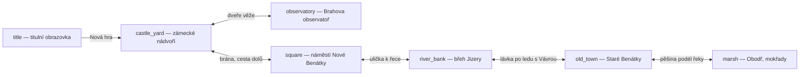
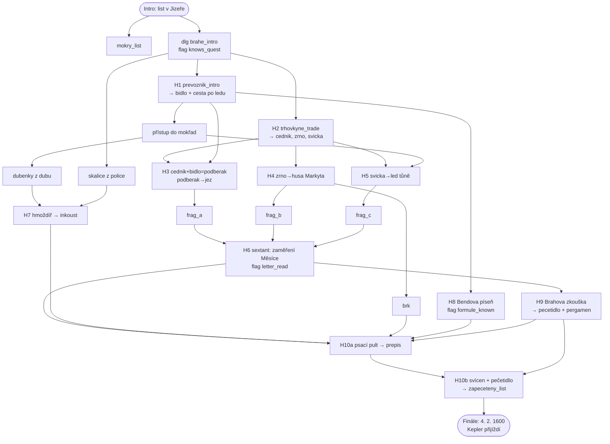

# ZTRACENÝ LIST — kompletní herní design
**Point-and-click adventura • Benátky nad Jizerou, zima 1599/1600 • styl Curse of Monkey Island**

Závazný design dokument. Všechna ID odkazují na kánon v `IDS.md`. Technika dle `CONTRACT.md`.

---

## 1. OVĚŘENÝ FAKTOGRAFICKÝ LIST

Fakta ověřena WebSearch (08/2026). Hra se odehrává v lednu–únoru 1600 — vše, co je ve hře
prezentováno jako pravda (Kronika, `fact:*`), stojí na těchto bodech.

| # | Fakt | Ověřeno |
|---|------|---------|
| F1 | Tycho Brahe přijel na zámek Benátky **20. 8. 1599** na pozvání císaře **Rudolfa II.** | benatky.cz, hvezdarna-benatky.cz |
| F2 | Rudolf II. mu nabídl **tři zámky**: Lysou nad Labem, Brandýs nad Labem a Benátky. Brahe si vybral Benátky — mj. kvůli poloze na návrší vhodné k pozorování oblohy. | benatky.cz, rozhlas.cz |
| F3 | Rodina bydlela v 1. patře; **observatoř a chemická (alchymistická) laboratoř ve 2. patře**, přístroje rozmístěny ve **13 místnostech**. Zámek se kvůli tomu přestavoval z císařských peněz. | benatky.cz, tajemnamista.cz |
| F4 | O **nos** přišel Brahe v prosinci **1566** v souboji s Manderupem Parsbergem (spor o matematiku!). Pověst mluví o **stříbrné** protéze; exhumace **2010** (Aarhus Univ., J. Vellev) prokázala **mosaz** (měď+zinek). | britannica.com, njrs.dk, thehistoryblog.com |
| F5 | **Johannes Kepler** přijel za Brahem na Benátky **4. 2. 1600** (některé prameny uvádějí už 3. 2.). Zůstal do června 1600. | utf.mff.cuni.cz, en.wikipedia.org/wiki/1600_in_science |
| F6 | Kepler u Braha poprvé získal přístup k přesným **pozorováním Marsu** — z nich později odvodil eliptické dráhy planet (Keplerovy zákony). | link.springer.com (Arch. Hist. Exact Sci.) |
| F7 | V červnu 1600 se Brahe přestěhoval do Prahy (Nový Svět, přístroje v Belvedéru). Zemřel 1601. | benatky.cz, cafeboheme.cz |
| F8 | Jméno **Benátky** = z italského **Venetia** (Venezia) přes slovinské *Benetke*; v češtině brzy obecně „**mokré, bažinaté místo při vodě**" — proto tolik českých Benátek. | ptejteseknihovny.cz, nase-rec.ujc.cas.cz |
| F9 | První zmínka **1259** — osada na **levém břehu Jizery** (dnešní Staré Benátky). | ptejteseknihovny.cz, benatkynadjizerou.cz |
| F10 | Kolem **1340** založil biskup **Jan z Dražic** na protějším (pravém) břehu městečko **Nové Benátky** (přenesení a povýšení na město se klade k r. 1343). | ptejteseknihovny.cz, hrady.cz |
| F11 | **1944** byly sloučeny **Nové Benátky, Staré Benátky a obec Obodř** → město **Benátky nad Jizerou**; později připojeny Dražice a Kbel. | benatkynadjizerou.cz, benatky.cz |
| F12 | **Rod Bendů** ze **Starých Benátek**: Jan Jiří Benda (1682–1757), tkadlec a lidový muzikant, starší tkalcovského cechu; syn **František Benda** (*22. 11. 1709 Staré Benátky) houslový virtuos u Fridricha II. Bendové počtem muzikantů předčili i Bachy. | cs.wikipedia.org/wiki/Benda_(rodina), benatky.cz/mesto/historie-mesta/rod-bendu |
| F13 | Duběnkový inkoust: **duběnky** (hálky žlabatky na dubu) + **zelená skalice** (síran železnatý) + pojivo — standardní inkoust od středověku po novověk. | obecně známá technologie, konzistentní s dobou |

**Řešení anachronismu Bendů:** rod Bendů je doložen až v 18. století. Ve hře proto vystupuje
fiktivní **„předek Bendů"** — potulný šumař a tkadlec **Matěj Benda** ze Starých Benátek, který
neustále (a marně) prorokuje, že „z jeho rodu jednou vzejde víc muzikantů než z rodu Bachů —
kdo to kdy je, ti Bachové". Kronika u faktu `fact_benda_family` poctivě uvádí, že hudební
sláva rodu patří až 18. století; Matěj je náš vtip, fakta jsou pravdivá.

**Poznámka k datu Keplerova příjezdu:** hra vrcholí 4. 2. 1600; Kronika zmiňuje i variantu 3. 2.

---

## 2. SYNOPSE — TŘI AKTY

**Hrdina:** Jiřík, čtrnáctiletý posel, drzý, dobrosrdečný, věčně promrzlý.
**Premisa:** Leden 1600. Jiřík nese na zámek císařský list od Rudolfa II. — potvrzení peněz na
dostavbu observatoře a svolení, aby Brahe přijal jistého Johannese Keplera ze Štýrska. Při
přechodu Jizery pod jezem se proboří led, list spadne do vody a proud ho roztrhá na kusy.

### AKT I — „Voda bere" (ztráta a sběr fragmentů)
Úvodní cutscéna: praskající led, list mizí ve vodě, Jiříkovi zbude jen rozmočený cár s kouskem
pečeti (`mokry_list`). Na zámku se přizná Brahovi. Ten soptí („Já přišel o nos, chlapče, a
nesu to. Ty jsi přišel o KUS PAPÍRU!"), ale potřebuje list do příjezdu Keplera — za tři dny.
Jiřík musí vylovit tři fragmenty: jeden se točí ve víru **pod jezem** (absurdní podběrák z
cedníku a bidla), druhý si **husa Markyta** zatáhla do hnízda v rákosí, třetí odplaval až do
**obodřských mokřadů**, kde přimrzl do tůně. Pomáhají převozník Vávra, trhovkyně Bětka
(výměnou za čerstvé drby ze zámku) a šumař Matěj Benda.

### AKT II — „Inkoust a paměť" (rekonstrukce textu)
Fragmenty jsou vylovené, ale písmo vybledlé vodou. V observatoři Brahe ukáže trik: tlak brku
zanechal v pergamenu rýhy — **šikmé světlo velkého sextantu** (zrcátko + měsíční svit pod
správným úhlem) písmo zviditelní. Hráč musí sextant správně zamířit (hádanka s přístroji).
Chybí ale úvodní formule listu (utržený roh) — tu zná, kdo ji slýchá při slavnostech: šumař
Benda ji umí **zazpívanou**; dialogová hádanka = poskládat verše jeho písně ve správném
pořadí. K přepisu je třeba vyrobit **duběnkový inkoust** (duběnky ze starého dubu v mokřadech
+ zelená skalice z Brahovy laboratoře, utřít v hmoždíři), sehnat **husí brk** (Markyta) a
**pergamen** (dá Brahe).

### AKT III — „Pečeť a sníh" (přepis, pečeť, Kepler)
Brahe nedá pečetidlo jen tak — vyzkouší Jiříka, zda zná obsah listu a pár věcí o svém
hostiteli (dialogová zkouška; správné odpovědi = fakta z Kroniky, včetně chytáku se
„stříbrným" nosem). Jiřík u psacího pultu vyhotoví **přepis**, zapečetí ho voskem ze svíčky
Brahovým pečetidlem — a v tu chvíli zvon ohlásí saně: **4. února 1600 přijíždí Kepler**.
Jiřík mu na nádvoří předá list. Brahe: „Vítejte, pane Keplere. Doufám, že s čísly zacházíte
lépe než zdejší pošta s papírem." Závěrečná koláž: co z toho setkání vzešlo (Mars, elipsy),
a titulky nad zasněženými Benátkami.

---

## 3. SCÉNY (7)

### 3.0 Mapa propojení exitů



Hub = `square`. Řetěz `river_bank ↔ old_town` hlídá převozník (po `prevoznik_intro` volně).
Všechny exity obousměrné, žádná scéna se nezamyká → žádný dead-end.

Společné zimní dynamické prvky všech exteriérů: **sníh** (2 hloubkové vrstvy vloček, rychlost
dle parallaxy), **pára od úst** postav, **stopy ve sněhu** za hráčem (fade 20 s).

---

### 3.1 `title` — Titulní obrazovka
- **Denní doba:** hluboká noc, hvězdné nebe s Mléčnou dráhou nad siluetou zámku.
- **Paleta:** nebe `#0b1d3a` → `#1c3a5e`, hvězdy `#f5f0dc`, sníh `#dfe9f5`, silueta zámku `#111a2e`, titul zlatě `#e8b64c`, měsíc `#f0e6c8`.
- **Vrstvy (parallax):** 0.0 nebe+hvězdy → 0.15 měsíc a mraky → 0.35 vzdálené kopce → 0.6 zámek na návrší → 1.0 zasněžené střechy Nových Benátek + titul/menu.
- **Dynamika (3+):** ① pomalu padající sníh ve 3 hloubkách, ② mihotání hvězd + 1 padající hvězda ~30 s, ③ kouř z komínů (perlin šum), ④ teplé okno observatoře, které pravidelně zhasne a rozsvítí se (Brahe pozoruje).
- **Hudba:** `title_theme`. Menu: Nová hra / Pokračovat / CZ⇄EN.

### 3.2 `castle_yard` — Zámecké nádvoří (šířka 2600)
- **Denní doba:** pozdní zimní odpoledne, nízké zlaté slunce, dlouhé modré stíny.
- **Paleta:** nebe `#f4c98a` → `#a7c2d8`, zdi zámku `#d9c9a8`/`#b09a72`, sgrafita `#8a7454`, sníh `#eef3fa` se stíny `#9db4d6`, akcent korouhve `#a63a2e`.
- **Vrstvy:** 0.2 nebe+slunce → 0.45 zadní křídlo zámku a věž → 0.7 arkády, sluneční hodiny → 1.0 nádvoří, studna, saně, brána (walkBehind: sloupy arkád, roubení studny).
- **Dynamika (3+):** ① sníh, ② korouhev na věži ve větru (sinus), ③ vrabci u studny (odlétnou, když hráč přijde blíž), ④ pes Ryšák u boudy — zvedá hlavu, vrtí ocasem, ⑤ třpyt slunce na rampouších arkád.
- **Hotspoty:** `hs_cy_sundial` (sluneční hodiny — vtip: v zimě k ničemu), `hs_cy_well`, `hs_cy_sled`, `hs_cy_dog`, `hs_cy_tower_door` (exit observatoř), `hs_cy_gate` (exit náměstí), `hs_cy_snow_pile` (postavit sněhuláka — easter egg, flag `snowman_built`).
- **Hudba:** `castle_theme`.

### 3.3 `observatory` — Brahova observatoř (šířka 2200, interiér)
- **Denní doba:** noc; měsíční světlo velkým oknem + svíce; otevřená okenice na hvězdy.
- **Paleta:** stěny `#2e2438` → `#4a3a56`, mosaz přístrojů `#c9932e`/`#8a5f1e`, svit svící `#ffb347`, měsíční pruh `#b8cfe8`, dřevo `#5a4030`, papíry `#e8dcbe`.
- **Vrstvy:** 0.3 hvězdné nebe za oknem → 0.6 zadní stěna s policemi, glóbus, křivule → 1.0 velký sextant, kvadrant, psací pult, krb (walkBehind: sextant, pult).
- **Dynamika (3+):** ① plameny svící + tančící stíny přístrojů, ② kouř/pára z křivulí (destilace), ③ hvězdy za oknem se otáčejí (velmi pomalu, kolem Polárky!), ④ jiskry v krbu, ⑤ Brahův mosazný nos zablýskne, když se otočí ke svíci.
- **Hotspoty:** `hs_ob_sextant` (hádanka H6), `hs_ob_quadrant`, `hs_ob_globe`, `hs_ob_mortar` (hmoždíř — výroba inkoustu), `hs_ob_alembic`, `hs_ob_shelf_vitriol` (zelená skalice), `hs_ob_desk` (psací pult — přepis), `hs_ob_candle` (svícen — pečetění), `hs_ob_fireplace`, `hs_ob_marsnotes` (Brahova pozorování Marsu → fact).
- **Hudba:** `observatory_theme`. `lightTint: 'rgba(120,90,160,0.18)'`.

### 3.4 `river_bank` — Břeh Jizery pod jezem (šířka 2800)
- **Denní doba:** mrazivé ráno, mlha nad vodou, bledé slunce.
- **Paleta:** nebe `#dce8ef` → `#f2ead8`, mlha `#e8eef2` (alpha), voda `#3e5a66`/`#6e8a94` s pěnou `#dfeef2`, led u břehů `#bcd4e0`, rákos `#a8925e`, dřevo přívozu `#6b5138`.
- **Vrstvy:** 0.2 protější břeh (Staré Benátky v mlze) → 0.5 jez a hladina → 0.8 rákosí → 1.0 břeh, pramice, ohniště, hnízdo (walkBehind: pramice, trs rákosí).
- **Dynamika (3+):** ① tekoucí voda přes jez (posun sinusových pásů + pěna), ② mlha driftující nad hladinou, ③ husa Markyta — čistí si peří, syčí při přiblížení, ④ kouř z Vávrova ohniště, ⑤ sníh + kry otáčející se pod jezem.
- **Hotspoty:** `hs_rb_weir` (jez — vír s fragmentem), `hs_rb_boat`, `hs_rb_goose` + `hs_rb_nest`, `hs_rb_reeds`, `hs_rb_fire`, `hs_rb_ice_path` (exit Staré Benátky).
- **Hudba:** `river_theme`.

### 3.5 `square` — Náměstí Nové Benátky (šířka 2600)
- **Denní doba:** dopoledne, jasno, ostré zimní světlo.
- **Paleta:** nebe `#9ec4e0` → `#dceaf4`, fasády `#d8b894`, `#c46a4a`, `#8aa27a`, `#e0d4b0`, střechy `#a63a2e` pod sněhem `#eef3fa`, kostel `#cbb894`, oheň koše `#ff9040`.
- **Vrstvy:** 0.25 nebe + věž kostela → 0.55 zadní fronta domů s podloubím → 1.0 náměstí: stánek, zamrzlá kašna, pranýř, koš s ohněm (walkBehind: stánek, kašna).
- **Dynamika (3+):** ① sníh, ② vrány na hřebeni střechy (poposedávají, občas krákají — SFX `sfx_crow`), ③ plameny v železném koši + tetelení vzduchu nad ním, ④ prádlo/šály na šňůře u stánku ve větru, ⑤ kolemjdoucí měšťka přejde pozadím ~90 s.
- **Hotspoty:** `hs_sq_stall` (Bětka), `hs_sq_fountain` (zamrzlá kašna), `hs_sq_pillory`, `hs_sq_firebasket`, `hs_sq_church_door`, `hs_sq_castle_road` (exit zámek), `hs_sq_river_lane` (exit řeka).
- **Hudba:** `square_theme`.

### 3.6 `old_town` — Staré Benátky, šumař u zvonice (šířka 2400)
- **Denní doba:** podvečer, „modrá hodinka", rozsvěcující se okna.
- **Paleta:** nebe `#2c3e66` → `#7a5a78` → `#d88a5a` u obzoru, chalupy `#4a3c50`/`#6a5a48`, okna teple `#ffcf6e`, sníh `#c8d4ec` (modrý!), zvonice `#3a3348`.
- **Vrstvy:** 0.2 nebe se soumrakem a prvními hvězdami → 0.5 řeka + protější břeh (Nové Benátky se zámkem, svítící okna) → 0.8 chalupy, tkalcovna → 1.0 náves, zvonice, Bendův plácek s ohýnkem (walkBehind: roh chalupy).
- **Dynamika (3+):** ① sníh, ② okna se postupně rozsvěcují (t-based), ③ Bendův ohýnek + jiskry, ④ Benda hraje: smyčec se hýbe, noty (křivky) stoupají a mizí, ⑤ netopýr/sova přeletí siluetu ~60 s.
- **Hotspoty:** `hs_ot_benda` (postava), `hs_ot_belfry` (zvonice — první zmínka 1259 → fact), `hs_ot_loom_house` (tkalcovna — vtip o tkalcovsko-muzikantském rodu), `hs_ot_tavern_door`, `hs_ot_marsh_path` (exit mokřady), `hs_ot_ice_path` (exit řeka).
- **Hudba:** `oldtown_theme` (Bendův motiv — diegeticky: blíž k Bendovi hlasitější housle).

### 3.7 `marsh` — Obodř, zamrzlé mokřady (šířka 2600)
- **Denní doba:** mlhavý soumrak přecházející v šero; nejstrašidelnější scéna.
- **Paleta:** mlha `#b8c4c8` → `#7a8a92`, voda/led tůní `#4e6470`/`#9ab4bc`, rákos a ostřice `#8a7a4e`/`#5e5638`, starý dub `#3e3428`, bludičky `#aef0c8`, nebe `#8a96a8`.
- **Vrstvy:** 0.2 mléčná mlha se siluetami vrb → 0.5 hladiny tůní a rákosové ostrovy → 0.8 starý dub → 1.0 pěšina z hatí, zamrzlá tůň (walkBehind: kmen dubu, přední rákos).
- **Dynamika (3+):** ① vlnící se pásy mlhy (3 vrstvy, různé rychlosti), ② bludičky — zelenkavá světélka bloudící nad tůněmi (vtip: Jiřík se bojí, Brahe by řekl „bahenní plyn"), ③ volavka stojící na jedné noze, občas zaloví, ④ rákos ševelící ve větru, ⑤ praskání ledu — trhlinky se občas rozeběhnou po tůni (SFX `sfx_ice_crack`).
- **Hotspoty:** `hs_ma_oak` (starý dub — duběnky), `hs_ma_ice_pool` (tůň s přimrzlým fragmentem), `hs_ma_wisps` (bludičky), `hs_ma_heron`, `hs_ma_reeds`, `hs_ma_causeway` (exit Staré Benátky).
- **Hudba:** `marsh_theme`.

---

## 4. POSTAVY

| ID | Jméno | Role | textColor |
|----|-------|------|-----------|
| `jirka` | Jiřík | hrdina, posel | `#ffe9a8` |
| `brahe` | Tycho Brahe | astronom, cholerik se zlatým srdcem | `#d9b8ff` |
| `kepler` | Johannes Kepler | host finále | `#b8e0ff` |
| `benda` | Matěj Benda | šumař, „předek Bendů" | `#ff9e64` |
| `prevoznik` | Vávra | převozník | `#9fd8c0` |
| `trhovkyne` | Bětka | trhovkyně | `#ffa8c8` |

### `jirka` — Jiřík
- **Povaha:** drzý, zvědavý, upřímný; komentuje svět jednou větou navíc. Bojí se bludiček a hus.
- **Vizuál:** 14 let, výška 300 px; zrzavé rozcuchané vlasy zpod kulicha, záplatovaný hnědý kabátec, dlouhá červená šála (sekundární animace!), brašna přes rameno, velké boty. Pohyb pružný, doskakuje.
- **Repliky:** CZ „Já ten list neztratil. Jen jsem ho... svěřil řece." / EN "I didn't lose the letter. I merely... entrusted it to the river." • CZ „Husy jsou jen draci, co to vzdali." / EN "Geese are just dragons that gave up."

### `brahe` — Tycho Brahe
- **Povaha:** hřmotný, ješitný, geniální; každou výtku zakončí astronomickou metaforou. Na nos je citlivý — a přesně proto o něm pořád mluví.
- **Vizuál:** výška 360 px; mohutný, zrzavý knír a špičatá bradka, černý kabátec se zlatým řetězem (řád slona), okruží, **mosazný nos, který se blýská ve svitu svící** (samostatný highlight v draw). Gesta: ukazuje na oblohu.
- **Repliky:** CZ „Přesnost, chlapče! Vesmír odpouští málo a já ještě míň." / EN "Precision, boy! The universe forgives little, and I forgive less." • CZ „Stříbrný? Pche. Mosaz drží líp a leští se sama." / EN "Silver? Pah. Brass holds better and polishes itself."

### `kepler` — Johannes Kepler
- **Povaha:** tichý, krátkozraký, zdvořilý; myšlenky mu utíkají k číslům uprostřed věty.
- **Vizuál:** výška 330 px; útlý, tmavý prostý kabát, bílý límec, brýle na šňůrce, deska s papíry pod paží, sníh na ramenou (přijel právě teď).
- **Repliky:** CZ „Cesta ze Štýrska byla dlouhá... šest set dvanáct tisíc kroků, počítal jsem je." / EN "The road from Styria was long... six hundred twelve thousand steps. I counted." • CZ „Pan Brahe má data. Já mám jen otázky. To bude buď zázrak, nebo katastrofa." / EN "Master Brahe has the data. I have only questions. This will be a miracle or a disaster."

### `benda` — Matěj Benda („předek Bendů")
- **Povaha:** rozšafný šumař a tkadlec; mluví v rytmu, půlku vět zpívá. Prorokuje slávu svého rodu (anachronismus přiznaný vtipem — viz kap. 1).
- **Vizuál:** výška 340 px; ošuntělý kožich, beranice s pérem, ruměné tváře, skřipky (housličky) a smyčec, u pasu tkalcovský člunek („přes den osnova, večer struny").
- **Repliky:** CZ „Pamatuj, chlapče: z Bendů budou jednou samí muzikanti. Víc než... než Bachů! Kdo to kdy je, ti Bachové." / EN "Mark me, lad: one day the Bendas will be all musicians. More than... than the Bachs! Whoever those Bachs may be." • CZ „Formuli císařskou? Tu neříkám, tu zpívám. Jinak si ji nepamatuju." / EN "The imperial formula? I don't say it, I sing it. It's the only way I remember."

### `prevoznik` — Vávra
- **Povaha:** flegmatický, mluví úsporně, o řece jako o živé osobě („Jizera dneska nemá náladu.").
- **Vizuál:** výška 350 px; širokánská ramena, ovčí vesta, vousiska ojíněná mrazem, fajfka (kouř = dynamika), bidlo v ruce. Majitel husy Markyty.
- **Repliky:** CZ „Přes led tě převedu. Pramice si do jara pospí." / EN "I'll walk you across the ice. The ferry sleeps till spring." • CZ „Markyta ti brk nedá. Markyta bere, Markyta nedává." / EN "Markyta won't give you a quill. Markyta takes, Markyta does not give."

### `trhovkyne` — Bětka
- **Povaha:** srdečná drbna; platidlem jsou novinky ze zámku. Ví všechno o všech kromě astronomie.
- **Vizuál:** výška 320 px; kulaťoučká, vlňák přes ramena, zástěra, nákrčník, u stánku svíčky, cedníky, zrní, sušená jablka; ruce v bok.
- **Repliky:** CZ „Prej má ten hvězdář nos ze stříbra! ...Z mosazi?! No to je ještě lepší drb!" / EN "They say the stargazer's nose is silver! ...Brass?! That's even better gossip!" • CZ „Cedník? Ten má díry schválně, mladej." / EN "The strainer? The holes are intentional, young man."

---

## 5. HÁDANKOVÝ SYSTÉM

**Cíl hry:** zrekonstruovat císařský list — vylovit fragmenty, zviditelnit písmo, vyrobit
inkoust z duběnek, získat brk, pergamen a pečetidlo, pořídit přepis a zapečetit ho — do
příjezdu Keplera.

### 5.1 Předměty (14)

| ID | Název CZ / EN | Získání |
|----|---------------|---------|
| `mokry_list` | Rozmočený cár listu / Soggy scrap | intro cutscéna; ukazuje kus pečeti |
| `frag_a` | Fragment listu — jez / Fragment (weir) | H3: podběrák na vír pod jezem |
| `frag_b` | Fragment listu — hnízdo / Fragment (nest) | H4: z hnízda husy Markyty |
| `frag_c` | Fragment listu — led / Fragment (ice) | H5: vytavit z tůně v mokřadech |
| `cednik` | Děravý cedník / Leaky strainer | Bětka po H2 |
| `bidlo` | Převoznické bidlo / Ferry pole | Vávra po `prevoznik_intro` |
| `podberak` | „Astronomický podběrák" / "Astronomical skimmer" | H3: cednik+bidlo |
| `zrno` | Pytlík zrní / Bag of grain | Bětka po H2 |
| `svicka` | Lojová svíčka / Tallow candle | Bětka po H2; taje led i pečetí |
| `dubenky` | Hrst duběnek / Handful of oak galls | dub v mokřadech |
| `skalice` | Zelená skalice / Green vitriol | police v laboratoři (Brahe dovolí) |
| `inkoust` | Duběnkový inkoust / Iron-gall ink | H7: hmoždíř |
| `brk` | Husí brk / Goose quill | H4: Markyta ho pustí |
| `pergamen` | Čistý pergamen / Blank parchment | Brahe po H9 |
| `pecetidlo` | Brahovo pečetidlo / Brahe's signet | Brahe po H9 |
| `prepis` | Přepis listu / Fair copy | H10a: psací pult |
| `zapeceteny_list` | Zapečetěný list / Sealed letter | H10b: svícen+pečetidlo |

*(mokry_list, podberak, prepis, zapeceteny_list jsou stavové transformace — inventář nikdy
nepřesáhne ~10 položek najednou.)*

### 5.2 Hádanky (10)

| # | Název | Typ | Řešení → efekt |
|---|-------|-----|----------------|
| H1 | Vávrovo bidlo | dialog | `prevoznik_intro`: Vávra půjčí `bidlo` („řeka stejně stojí") a naučí cestu po ledu (exit old_town) |
| H2 | Drby za krám | dialogový obchod | po `brahe_intro` má Jiřík drby (flag `gossip_told` po `trhovkyne_trade`) → Bětka dá `cednik`, `zrno`, `svicka` |
| H3 | **Astronomický podběrák** | **absurdní kombinace** | `cednik`+`bidlo`→`podberak` (Jiřík: „Brahe má sextant, já mám tohle."); `podberak` na `hs_rb_weir` → `frag_a` |
| H4 | Husa Markyta | inventář+hotspot | `zrno` na `hs_rb_goose` → husa slézá (flag `goose_lured`); `hs_rb_nest` → `frag_b` + `brk` (vypadl jí) |
| H5 | List v ledu | inventář+hotspot | `svicka` na `hs_ma_ice_pool` → kroužek roztaje → `frag_c` (svíčka zůstává!) |
| H6 | **Sextant a měsíc** | **hádanka s Braheho přístroji** | všechny 3 fragmenty na `hs_ob_sextant` → minivolba zaměření: cíl „Měsíc nízko nad obzorem, zrcátkem šikmo na pult" (špatné volby = vtipné komentáře Braha, žádný trest) → rýhy po brku se zviditelní, flag `letter_read`, fact `fact_gall_ink` |
| H7 | Duběnkový inkoust | kombinace+hotspot | `dubenky`+`skalice`→ směs; směs na `hs_ob_mortar` → `inkoust` |
| H8 | **Bendova píseň** | **dialogová hádanka** | `benda_song`: Benda zpívá 4 verše císařské formule na přeskáčku; hráč je v dialogu skládá správně („Z Boží milosti… Rudolf Druhý… volený císař římský… uherský a český král"); 2 chyby = Benda spustí znovu (jinak proházené) → flag `formule_known` |
| H9 | Brahova zkouška | dialogová zkouška | `brahe_test` (vyžaduje `letter_read`): 3 otázky — kdo mě pozval? (Rudolf II.), který zámek jsem si vybral a proč? (Benátky, návrší), z čeho je můj nos? (chyták: „ze stříbra" = špatně → „Z MOSAZI!") → `pecetidlo` + `pergamen`, flag `brahe_test_passed` |
| H10 | Přepis a pečeť | finální syntéza | a) `pergamen` na `hs_ob_desk` (nutné: `inkoust`,`brk`,`letter_read`,`formule_known`) → `prepis`; b) `prepis` na `hs_ob_candle` (nutné `pecetidlo`) → `zapeceteny_list`; c) `zapeceteny_list` na `brahe` → cutscéna finále, `kepler_arrival` |

### 5.3 Dependency graf (Mermaid, acyklický, bez dead-endů)



*Kontrola:* graf je DAG; každý předmět má právě jeden zdroj, nic se nespotřebuje nevratně
(svíčka i bidlo zůstávají), všechny scény zůstávají přístupné → hra je vždy dohratelná.

### 5.4 Tabulka interakcí hotspot × předmět → efekt (výběr, závazné)

| Scéna | Hotspot | Předmět/sloveso | Efekt |
|-------|---------|-----------------|-------|
| castle_yard | hs_cy_sundial | oko | Jiřík: „Sluneční hodiny v lednu. Ukazují ‚běž dovnitř'." |
| castle_yard | hs_cy_dog | ruka | Ryšák se nechá podrbat, SFX `sfx_dog`; s `brk`: „Ne, tohle není aport." |
| castle_yard | hs_cy_snow_pile | ruka (3×) | postaví sněhuláka s mosazným „nosem" z rampouchu; flag `snowman_built`; Brahe u okna: „TO NENÍ VTIPNÉ." |
| observatory | hs_ob_sextant | frag_a/b/c | H6 – po vložení všech tří spustí zaměřovací volbu |
| observatory | hs_ob_sextant | oko | fact `fact_observatory_rooms` |
| observatory | hs_ob_shelf_vitriol | ruka | `skalice` (jen po `brahe_intro`, jinak Brahe: „Nesahat!") |
| observatory | hs_ob_mortar | směs dubenky+skalice | `inkoust`, SFX `sfx_grind` |
| observatory | hs_ob_marsnotes | oko | fact `fact_kepler_mars` |
| observatory | hs_ob_desk | pergamen | H10a → `prepis` (kontrola flagů, jinak Jiřík vysvětlí, co chybí) |
| observatory | hs_ob_candle | prepis | H10b → `zapeceteny_list`, SFX `sfx_seal` |
| observatory | brahe | zapeceteny_list | finální cutscéna |
| river_bank | hs_rb_weir | podberak | `frag_a`, SFX `sfx_splash` |
| river_bank | hs_rb_weir | cednik | „Bez násady? To bych tam spadl i já." (nápověda) |
| river_bank | hs_rb_goose | zrno | `goose_lured`, SFX `sfx_goose` |
| river_bank | hs_rb_goose | ruka (bez zrna) | husa syčí, Jiřík uskočí — walk cycle dozadu |
| river_bank | hs_rb_nest | ruka (po goose_lured) | `frag_b` + `brk` |
| square | hs_sq_fountain | oko | „Kašna drží vodu. Konečně někdo." |
| square | hs_sq_firebasket | svicka | „Už hoří. Nebudu nosit oheň do ohně." |
| marsh | hs_ma_oak | ruka | `dubenky`; oko → fact o duběnkách |
| marsh | hs_ma_ice_pool | svicka | `frag_c`, SFX `sfx_ice_crack` |
| marsh | hs_ma_ice_pool | bidlo | „Prasklo by. Led, ne bidlo. Teda... obojí." |
| marsh | hs_ma_wisps | oko | Jiřík se bojí; Brahe později: „Bahenní plyn, chlapče." → fact `fact_name_venice` vazba na mokřady |
| old_town | hs_ot_belfry | oko | fact `fact_first_mention_1259` |
| old_town | hs_ot_loom_house | oko | fact `fact_benda_family` |
| old_town | benda | ústa | `benda_intro` → `benda_song` (H8) |

Defaultní odpovědi pro nesmyslné kombinace generuje engine (pool 6 hlášek Jiříka, např.
CZ „To by nefungovalo ani v pohádce." / EN "That wouldn't work even in a fairy tale.").

---

## 6. HUDBA A ZVUK

### 6.1 Leitmotivy a instrumentace
| Motiv | Kde | Nástroje (WebAudio) |
|-------|-----|---------------------|
| **Jiříkův motiv** (stoupavá kvarta d–g, dorský) | title, finale, přechody | flétna (sinus+dech šum), loutna KS |
| **Brahův motiv** (klesající půltón + zvon) | castle, observatory, test | zvony (FM/inharm. partials), viola (pila+LP filtr) |
| **Motiv řeky** (perpetuum arpeggio) | river, marsh (zpomalené) | loutna Karplus-Strong |
| **Bendův motiv** (skočná, předjímá klasicismus — vtip) | old_town, píseň H8 | „skřipky" (pila+vibrato), loutna |

Adaptivní vrstvy: základ (loutna/drone) hraje vždy; melodická vrstva jen když hráč stojí;
zvonová vrstva v observatoři jen v cutscénách. Crossfade 2 s zajišťuje engine.

### 6.2 Tracky — melodie jako pole [midi, doby] (tempo ~92 BPM, doba = čtvrťová)
```js
// title_theme — Jiříkův motiv nad hvězdným drone (d dorský)
[[62,1],[65,1],[69,1],[74,2],[72,1],[69,1],[67,1],[69,3],[65,1],[67,1],[62,4]]
// castle_theme — slavnostní, zvony na těžké doby (D dur)
[[50,2],[57,2],[62,1],[66,1],[69,2],[67,1],[66,1],[64,2],[62,2],[57,2],[62,4]]
// observatory_theme — mystické, viola drone E + zvonkohra (e frygický)
[[64,2],[65,1],[67,1],[71,2],[67,1],[65,1],[64,4],[59,2],[64,6]]
// river_theme — loutnové arpeggio, plyne jako voda (G mixolydický)
[[55,.5],[59,.5],[62,.5],[67,.5],[66,.5],[62,.5],[60,1],[59,1],[57,.5],[59,.5],[55,2]]
// square_theme — trhová skočná (C dur), flétna
[[60,.5],[64,.5],[67,.5],[64,.5],[69,1],[67,.5],[65,.5],[64,.5],[62,.5],[60,2],[67,1],[60,1]]
// oldtown_theme — Bendův motiv, skřipky (a moll → A dur kadence)
[[69,.5],[72,.5],[76,1],[74,.5],[72,.5],[71,1],[72,.5],[74,.5],[76,1],[73,.5],[74,.5],[69,2]]
// marsh_theme — nízký drone + váhavá flétna (d moll)
[[50,3],[53,1],[55,2],[53,1],[50,4],[46,2],[50,4]]
// finale_theme — Jiříkův motiv v D dur + Brahovy zvony, plné vrstvy
[[62,1],[66,1],[69,1],[74,2],[73,.5],[74,.5],[76,2],[74,1],[71,1],[69,1],[66,1],[62,4]]
```
Mapování scén: `title→title_theme, castle_yard→castle_theme, observatory→observatory_theme,
river_bank→river_theme, square→square_theme, old_town→oldtown_theme, marsh→marsh_theme,
finále (cutscéna)→finale_theme`.

### 6.3 SFX (WebAudio syntéza)
`sfx_splash` (šum+LP sweep), `sfx_ice_crack` (prasknutí: krátký šum + klesající sinus),
`sfx_goose` (pila+rychlé AM), `sfx_bell` (FM zvon), `sfx_crow`, `sfx_dog`, `sfx_grind`
(hmoždíř: filtrovaný šum, rytmicky), `sfx_quill` (škrábání: hi-pass šum), `sfx_seal`
(tlumené žuchnutí), `sfx_snow_step`, `sfx_door`, `sfx_pickup`, `sfx_sleigh` (rolničky —
Keplerův příjezd).

---

## 7. FAKTA DO KRONIKY (13 × `fact:*`)

| ID | Text (CZ; EN analogicky) | Kde se získá |
|----|--------------------------|--------------|
| `fact_brahe_arrival` | Tycho Brahe přijel na zámek Benátky 20. 8. 1599 na pozvání Rudolfa II. | brahe_intro |
| `fact_three_castles` | Rudolf II. nabídl Brahovi tři zámky: Lysou, Brandýs a Benátky. Vybral si Benátky — návrší s výhledem na oblohu. | brahe_test |
| `fact_observatory_rooms` | Observatoř a alchymistická laboratoř byly ve 2. patře; přístroje ve 13 místnostech. Zámek se kvůli tomu přestavoval. | oko na sextant |
| `fact_brahe_nose` | Brahe přišel o nos 1566 v souboji s Manderupem Parsbergem — pohádali se o matematiku. Pověst říká stříbro; exhumace 2010 prokázala mosaz. | brahe_test (chyták) |
| `fact_kepler_arrival` | Johannes Kepler přijel za Brahem na Benátky 4. 2. 1600 (dle některých pramenů 3. 2.). | finále |
| `fact_kepler_mars` | Z Brahových přesných měření Marsu Kepler později odvodil, že planety obíhají po elipsách. | oko na hs_ob_marsnotes |
| `fact_brahe_prague` | V červnu 1600 se Brahe přestěhoval do Prahy; zemřel 1601. | finále (epilog) |
| `fact_name_venice` | Jméno Benátky pochází z italského Venetia (Venezia) přes slovinské Benetke; česky znamenalo „mokré místo u vody". | dialog s Vávrou / bludičky |
| `fact_first_mention_1259` | První zmínka o Benátkách je z roku 1259 — osada na levém břehu Jizery, dnešní Staré Benátky. | oko na zvonici |
| `fact_nove_benatky_1343` | Kolem 1340 založil biskup Jan z Dražic na protějším břehu Nové Benátky; k r. 1343 povýšeny na město. | trhovkyne_intro |
| `fact_merger_1944` | Roku 1944 se Nové Benátky, Staré Benátky a Obodř sloučily v Benátky nad Jizerou (epilogová vsuvka „co bude dál"). | epilog |
| `fact_benda_family` | Ze Starých Benátek pochází rod Bendů: tkadlec a muzikant Jan Jiří Benda (1682–1757) a jeho syn František (*1709), houslista pruského krále. Bendů-muzikantů bylo víc než Bachů. (Matěj ve hře je náš vymyšlený „předek".) | oko na tkalcovnu / benda_intro |
| `fact_gall_ink` | Inkoust se po staletí dělal z duběnek a zelené skalice — železoduběnkový inkoust psal i císařské listiny. | H6/H7 |

---

## 8. FINÁLE A EPILOG
Cutscéna: rolničky (`sfx_sleigh`), na nádvoří vjíždějí saně, vystupuje Kepler, sníh mu padá
na brýle. Jiřík předává `zapeceteny_list`. Brahe a Kepler odcházejí k věži, přou se už na
schodech (geocentrismus vs. „ale ta čísla, pane!"). Kamera stoupá k hvězdám — přechod do
titulní oblohy, epilogové titulky s fakty `fact_brahe_prague`, `fact_kepler_mars`,
`fact_merger_1944`. Kronika se na konci otevře s počtem nasbíraných faktů (X/13) —
motivace k druhému průchodu.
